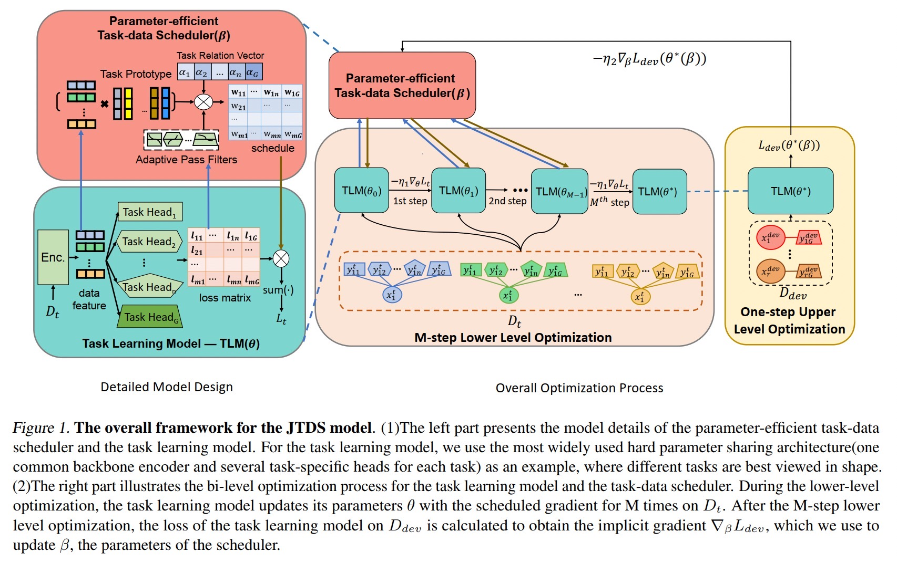

# Auxiliary Learning with Joint Task and Data Scheduling
by Hong Chen, Xin Wang, Chaoyu Guan, Yue Liu and Wenwu Zhu.

## Introduction
This work can be used when you want to learn a model for the target task with the help of some auxiliary tasks. This work helps you to find the most valuable data samples under each task so that your target task can learn better.

## Dataset
The provided code is for the CUB dataset in the paper. You can first download the dataset from the [link](http://www.vision.caltech.edu/visipedia/CUB-200-2011.html). Then unzip the dataset in the current folder, and split the dataset as follows: 
```
python data_preprocess.py
```
The dataset splitted information will be restored in the preprocess_data folder.

## Run the code
When you finish the data preprocessing process, you can run the script to reproduce the CUB experiments.
```
sh run_bilevel.sh
```
Additionally, if you want to run the noisy setting, change the corrupted to 1 and set the corresponding corrupted ratio.

## Scheduler implementation and bilevel optimization
The joint scheduler is implemented with the auxilearn.hypernet.MonoJoint. The upper level optimization process is shown in line 323- line376 in the train_bilevel.py.

## Citation
```
will give after camera ready
```

